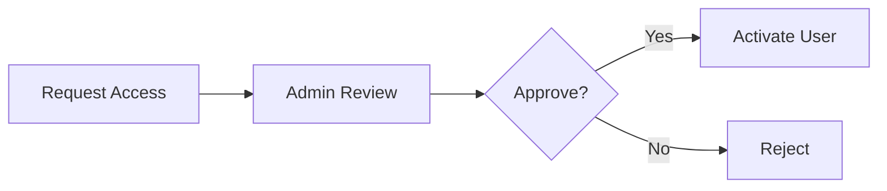

# Product Requirements Document: InventPro MVP

## Executive Summary

**Product:** InventPro
**Version:** MVP (1.0)
**Document Status:** Final
**Last Updated:** March 30, 2026

### Product Vision

InventPro aims to become a unified, real-time inventory and operations control system for small businesses, enabling complete visibility, secure access control, and data-driven decision-making through a modern and scalable platform.

### Success Criteria

* 90% reduction in manual inventory tracking errors
* <2 second dashboard load time
* 80%+ weekly active usage by onboarded teams
* Zero unauthorized access incidents

---

## Problem Statement

### Problem Definition

Small businesses and warehouse teams rely on fragmented tools (Excel, manual logs, disconnected systems) that lack real-time updates, proper access control, and actionable analytics.

### Impact Analysis

* **User Impact:** Time loss, stock mismatches, poor decision-making
* **Market Impact:** Large underserved SMB inventory software market
* **Business Impact:** Opportunity for SaaS monetization and retention

---

## Target Audience

### Primary Persona: Warehouse Manager

**Demographics:**

* Age: 25–45
* Works in SMB logistics/retail

**Psychographics:**

* Efficiency-driven
* Needs accuracy and control

**Jobs to Be Done:**

1. Track inventory in real-time
2. Avoid stockouts/overstock
3. Maintain operational control

**Current Solutions & Pain Points:**

| Current Solution | Pain Points   | Our Advantage          |
| ---------------- | ------------- | ---------------------- |
| Excel            | Manual errors | Automation + real-time |
| Basic POS        | No analytics  | Advanced dashboards    |

### Secondary Personas

* Small Business Owners
* Retail Sales Staff

---

## User Stories

### Epic: Inventory & Operations Management

**Primary User Story:**
"As a warehouse manager, I want to track inventory in real time so that I can make accurate operational decisions"

**Acceptance Criteria:**

* [ ] Inventory updates instantly
* [ ] Low stock alerts trigger automatically
* [ ] Dashboard reflects real-time data

### Supporting User Stories

1. "As an admin, I want to approve user access so that system security is maintained"

   * **AC:** Request approval workflow works correctly

2. "As a sales staff, I want to create orders so that inventory updates automatically"

   * **AC:** Order creation updates stock

---

## Functional Requirements

### Core Features (MVP — P0)

#### Feature 1: Dashboard

* **Description:** Real-time KPI visualization
* **User Value:** Instant insights
* **Business Value:** Better decisions
* **Acceptance Criteria:**

  * [ ] Metrics update in real-time
  * [ ] Charts render correctly
* **Dependencies:** Analytics engine
* **Estimated Effort:** Large

#### Feature 2: Inventory Management

* **Description:** Product and stock tracking
* **User Value:** Accurate stock
* **Business Value:** Reduced loss
* **Acceptance Criteria:**

  * [ ] CRUD operations work
  * [ ] Stock updates reflect instantly
* **Estimated Effort:** Large

#### Feature 3: RBAC & User System

* **Description:** Role-based access control
* **User Value:** Secure usage
* **Business Value:** Data protection
* **Acceptance Criteria:**

  * [ ] Roles enforce permissions
  * [ ] Access requests workflow works
* **Estimated Effort:** Large

### Should Have (P1)

* Advanced analytics
* Vendor scoring

### Could Have (P2)

* AI forecasting
* Mobile app

### Out of Scope (Won't Have)

* Blockchain inventory tracking
* Hardware integrations (initially)

---

## Non-Functional Requirements

### Performance

* Page Load: < 2 seconds
* API Response: < 200ms
* Concurrent Users: 1,000
* Uptime: 99.9%

### Security

* Authentication: JWT + OTP
* Authorization: RBAC
* Data Protection: Encrypted storage

### Usability

* Accessibility: WCAG 2.1 AA
* Mobile: Responsive

### Scalability

* Support 10x growth

---

## Quality Standards (Anti-Vibe Rules)

### Code Quality Requirements

* Strict TypeScript
* Service-based architecture
* 80% test coverage

### Design Quality Requirements

* Design tokens only
* WCAG compliance

### What This Project Will NOT Accept

* Placeholder content
* Skipped tests

---

## UI/UX Requirements

### Design Principles

1. Clarity over complexity
2. Real-time feedback
3. Role-based simplicity

### Information Architecture

```
├── Dashboard
├── Inventory
├── Orders
├── Vendors
├── Users
├── Requests
└── Settings
```

### Key User Flows

#### Flow 1: User Access Approval



---

## Success Metrics

### North Star Metric

Active inventory operations per day

### OKRs for MVP (First 90 Days)

**Objective 1:** Achieve adoption

* KR1: 100 active users
* KR2: 70% retention
* KR3: <2% error rate

### Metrics Framework

| Category    | Metric     | Target | Measurement |
| ----------- | ---------- | ------ | ----------- |
| Acquisition | Signups    | 500    | Analytics   |
| Activation  | First use  | 80%    | Logs        |
| Retention   | Weekly use | 70%    | DB          |
| Revenue     | MRR        | TBD    | Billing     |
| Referral    | Invites    | TBD    | Tracking    |

---

## Constraints & Assumptions

### Constraints

* Budget: TBD
* Timeline: 3–6 months
* Team: Small dev team

### Assumptions

* Users need real-time systems
* SMB market demand exists

### Open Questions

* Pricing model?
* Deployment model?

### Dependencies

* Email service
* Hosting infra

---

## Risk Assessment

| Risk            | Probability | Impact | Mitigation     |
| --------------- | ----------- | ------ | -------------- |
| Security breach | Medium      | High   | Strong RBAC    |
| Scaling issues  | Medium      | Medium | Modular design |

---

## MVP Definition of Done

### Feature Complete

* [ ] All P0 features implemented
* [ ] Acceptance criteria met

### Quality Assurance

* [ ] Tests > 80%
* [ ] Performance validated

### Documentation

* [ ] API docs complete

### Release Ready

* [ ] Monitoring setup
* [ ] Rollback plan ready

---
