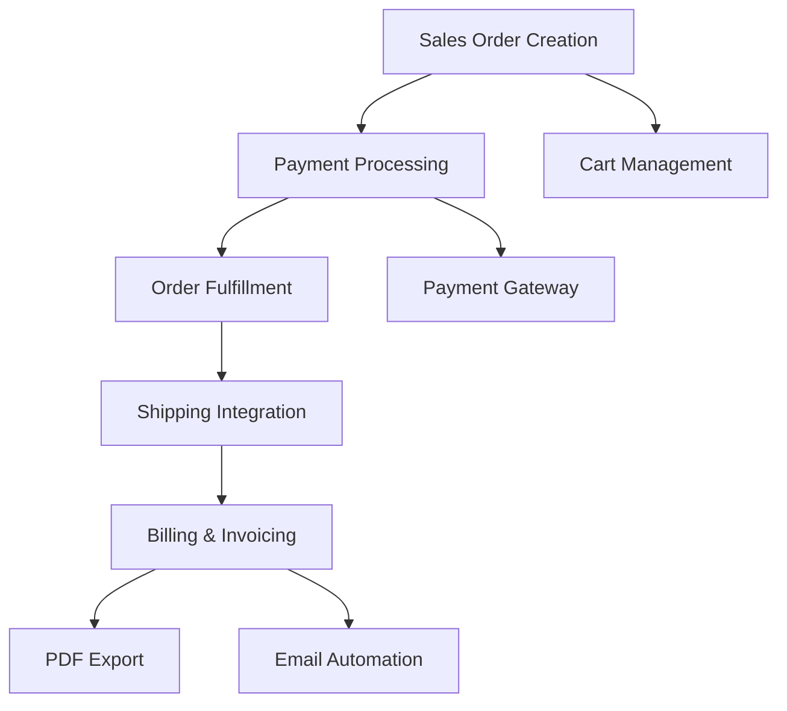

# ROADMAP: InventPro MVP

---

## 📅 Project History & Completed Milestones

| Milestone | Phase | Status | Key Deliverables |
|-----------|-------|--------|------------------|
| **M1: Foundation** | Phase 1: Security | ✅ | Route Guards, RBAC, Protected Components |
| | Phase 2: Inventory | ✅ | Product CRUD, Pagination, Stock Tracking |
| | Phase 3: Sales | ✅ | Cart Sync, Order Workflow, History |
| **M2: Operations** | Phase 4: Vendors | ✅ | Supplier Management, PO System, Receiving |
| | Phase 5: Analytics | ✅ | Charts, Summary APIs, CSV Exports |
| **M3: Optimization**| Phase 6: Redux | ✅ | RTK Query Migration, Global State Persistence |
| | Phase 7: Audit | ✅ | Activity Logs, Notifications, Security Audit |
| **M4: Validation** | Phase 8: Verification| ✅ | System-wide QA, Edge Case Handling, 100% verified |
| **M5: Features** | Phase 9: Real-Time | ✅ | Socket.IO, Live Inventory, Presence indicators |
| **M6: Financials**| Phase 10: Payments | ✅ | Razorpay/Stripe, Cart, Checkout, Invoicing |

---

## 🚀 Current Milestone: Advanced Financials & Billing

### Phase 10: Payment Processing, Sales Order & Billing System
**Status**: ✅ Completed
**Goal**: Implement a comprehensive payment workflow, sales order management, and billing system to handle customer transactions, track payments, and generate invoices.

#### Core Architecture

#### Task Breakdown:

**Task P1: Database Models & Schema Design**
- [x] Create `Customer` model (`backend/models/customer.model.js`)
- [x] Create `SalesOrder` model (`backend/models/salesOrder.model.js`)
- [x] Create `Payment` model (`backend/models/payment.model.js`)
- [x] Create `Invoice` model (`backend/models/invoice.model.js`)
- [x] Create `PaymentGateway` model (`backend/models/paymentGateway.model.js`)

**Task P2: Payment Gateway Integration**
- [x] Integrate Razorpay (Indian payment gateway)
- [x] Integrate Stripe (International)
- [x] Create payment service (`backend/services/payment.service.js`)
- [x] Implement webhook handlers for payment callbacks
- [x] Add payment status synchronization

**Task P3: Customer Management System (CRM)**
- [x] Create customer CRUD operations
- [x] View customer order history & credit management
- [x] Implement customer search and filter
- [x] Create customer dashboard (LTV, Order rates)
- [x] Add customer import/export (CSV)

**Task P4: Shopping Cart & Checkout**
- [x] Create persistent cart in Redux (localStorage sync)
- [x] Implement cart management (discounts, tax calc)
- [x] Create checkout workflow (Address collection, method selection)
- [x] Add guest checkout support

**Task P5: Sales Order Processing**
- [x] Create sales order creation (Cart -> Order)
- [x] Implement order status workflow (Draft -> Paid -> Shipped)
- [x] Add order tracking & status history
- [x] Create order modification (pre-fulfillment)

**Task P6: Billing & Invoicing System**
- [x] Create invoice generation (INV Number, Tax, PDF)
- [x] Implement automatic PDF export
- [x] Set up email service for invoices
- [x] Create payment reconciliation reports

---

## 🛠️ Verification Status

| Module | Status | Recent Fixes |
|--------|--------|--------------|
| Authentication | ✅ Verified | Hashed passwords in seeder, Header auth support |
| Inventory | ✅ Verified | 100+ items seeded, Negative stock guard |
| Sales/Orders | ✅ Verified | Legacy orders (9-14) integrated |
| RTK Query | ✅ Verified | Automatic cache invalidation on seeding |
| Socket.IO | ✅ Verified | Stock status broadcast working |

---

## 🔮 Future Roadmap (Milestone 6)
- [ ] Multi-warehouse support
- [ ] Mobile PWA optimization
- [ ] AI-driven demand forecasting
- [ ] Multi-lingual support (i18n)

---
**Last Updated**: 2026-03-31
**Project Status**: 🟢 On Track for Payment System launch.