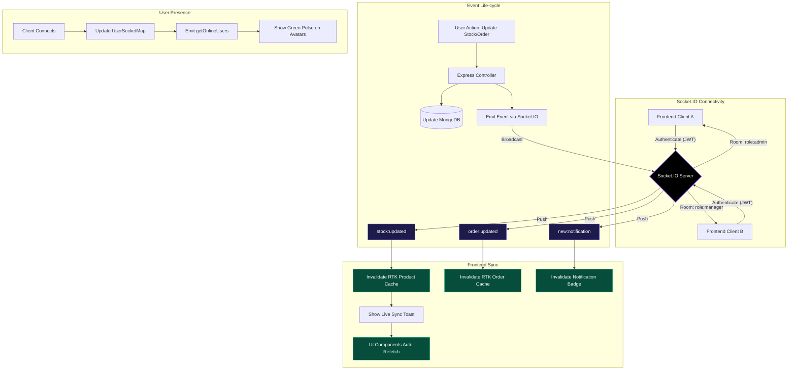
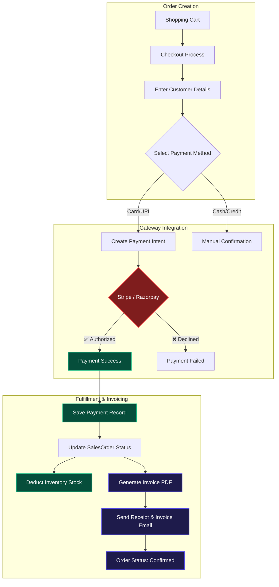
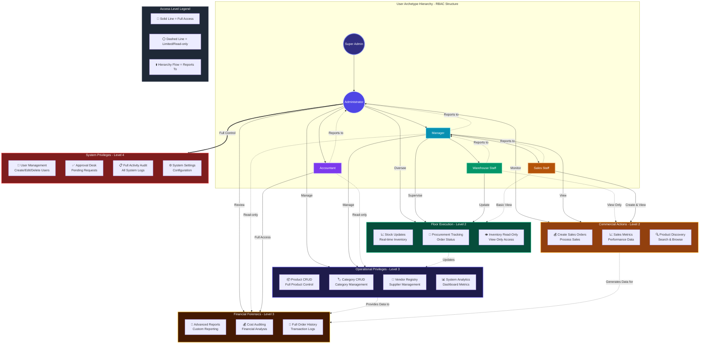

# InventPro Website Workflow & Connectivity

This document outlines the user flow and connectivity of pages within the InventPro application.

## High-Level Workflow Diagram

```mermaid
graph TD
    %% Start Node
    Start((Start)) --> LoginPage[Login Page]
    
    %% Authentication Flow with Decision Points
    subgraph Auth_Flow [Authentication Workflow]
        LoginPage --> EnterCred[Enter Credentials]
        EnterCred --> ValidateCred{Validate Credentials}
        
        ValidateCred -->|✅ Success| CheckStatus{Check User Status}
        ValidateCred -->|❌ Failure| ShowError[Show Error Message]
        ShowError -->|Retry| EnterCred
        
        CheckStatus -->|✅ Active| CheckRole{Check User Role}
        CheckStatus -->|❌ Inactive| ShowInactive[Account Inactive]
        CheckStatus -->|⏳ Pending| ShowPending[Approval Pending]
        ShowInactive -->|Contact Admin| LoginPage
        ShowPending -->|Wait for Approval| LoginPage
        
        CheckRole -->|Admin| AdminDashboard[Admin Dashboard]
        CheckRole -->|Manager| ManagerDashboard[Manager Dashboard]
        CheckRole -->|Staff| StaffDashboard[Staff Dashboard]
        CheckRole -->|Sales| SalesDashboard[Sales Dashboard]
        CheckRole -->|Accountant| AccountantDashboard[Accountant Dashboard]
    end

    %% Forgot Password Flow with OTP Verification
    subgraph Forgot_Password [Password Reset Workflow]
        LoginPage -->|Forgot Password| ForgotPass[Forgot Password]
        ForgotPass --> EnterEmail[Enter Registered Email]
        EnterEmail --> CheckEmail{Email in System?}
        
        CheckEmail -->|✅ Found| GenerateOTP[Generate 4-digit OTP]
        CheckEmail -->|❌ Not Found| EmailError[Email Not Registered]
        EmailError -->|Try Again| EnterEmail
        
        GenerateOTP --> SendOTP[Send OTP via Email]
        SendOTP --> OTPVerification[Enter OTP]
        OTPVerification --> ValidateOTP{Validate OTP}
        
        ValidateOTP -->|✅ Correct| SetNewPass[Set New Password]
        ValidateOTP -->|❌ Incorrect| OTPError[Invalid OTP]
        OTPError -->|Try Again| OTPVerification
        ValidateOTP -->|⌛ Expired| OTPExpired[OTP Expired]
        OTPExpired -->|Request New| ForgotPass
        
        SetNewPass --> EnterNewPass[Enter New Password]
        EnterNewPass --> ConfirmNewPass[Confirm New Password]
        ConfirmNewPass --> ValidatePass{Passwords Match?}
        
        ValidatePass -->|✅ Yes| UpdatePassword{Update in DB}
        ValidatePass -->|❌ No| PassMismatch[Passwords Don't Match]
        PassMismatch -->|Re-enter| SetNewPass
        
        UpdatePassword -->|✅ Success| PasswordReset[Password Updated ✓]
        UpdatePassword -->|❌ Failure| UpdateError[Database Error]
        UpdateError -->|Retry| UpdatePassword
        
        PasswordReset -->|Redirect to| LoginPage
    end

    %% Enhanced Request Access Flow with Email Notifications
    subgraph Request_Access [Request Access Workflow]
        LoginPage -->|Request Access| RequestForm[Request Access Form]
        RequestForm --> EnterDetails[Enter Name & Email]
        EnterDetails --> CheckUserExists{Check if User Exists}
        
        CheckUserExists -->|✅ Already Exists| UserExistsMsg[User Already Exists]
        CheckUserExists -->|❌ New User| CreatePending[Create Pending Request]
        
        UserExistsMsg -->|Redirect to| LoginPage
        
        CreatePending --> SendAdminEmail[Send Request Email to Admin]
        SendAdminEmail --> SendUserWaiting[Send Waiting Email to User]
        SendUserWaiting --> PendingApproval[Pending Approval Status]
        
        PendingApproval --> AdminReview{Admin Reviews Request}
        
        AdminReview -->|✅ Approve| ApproveRequest[Approve Request]
        AdminReview -->|❌ Reject| RejectRequest[Reject Request]
        
        ApproveRequest --> CreateUserAccount[Create User Account]
        CreateUserAccount --> SendApprovalEmail[Send Approval Email to User]
        SendApprovalEmail --> AccountCreated[Account Created ✓]
        AccountCreated -->|User Can Now Login| LoginPage
        
        RejectRequest --> SendRejectionEmail[Send Rejection Email to User]
        SendRejectionEmail --> RequestDenied[Request Denied]
        RequestDenied -->|Back to| LoginPage
    end

    %% Main Application Operations
    subgraph Operations [Core Operations Flow]
        %% Admin Dashboard Operations
        AdminDashboard --> AdminActions{Select Action}
        AdminActions -->|User Management| UserMgmt[User Management]
        AdminActions -->|Approvals| ApprovalDesk[Approval DeskDesk]
        AdminActions -->|Settings| SysSettings[System Settings]
        AdminActions -->|Security Audit| SecAudit[Security & Audit Logs]
        
        %% Manager Dashboard Operations
        ManagerDashboard --> ManagerActions{Select Action}
        ManagerActions -->|Inventory| InvMgmt[Inventory Management]
        ManagerActions -->|Categories| CatMgmt[Category Management]
        ManagerActions -->|Vendors| VendorRegistry[Vendor Registry]
        ManagerActions -->|Reports| ViewReports[View Reports]
        
        %% Staff Dashboard Operations
        StaffDashboard --> StaffActions{Select Action}
        StaffActions -->|Update Stock| StockUpdate[Stock Update]
        StaffActions -->|Movements| StockMoves[Stock Movements]
        
        %% Sales Dashboard Operations
        SalesDashboard --> SalesActions{Select Action}
        SalesActions -->|POS / Cart| POCart[POS Shopping Cart]
        SalesActions -->|Customer CRM| CRM_Hub[Customer CRM]
        SalesActions -->|Sales Orders| S_Orders[Sales Orders List]
        
        %% Accountant Dashboard Operations
        AccountantDashboard --> AccountantActions{Select Action}
        AccountantActions -->|Billing| InvBilling[Invoices & Billing]
        AccountantActions -->|Financials| FinReports[Generate Reports]
        AccountantActions -->|Audit| ViewAudit[View Audit Log]
    end

    %% CRUD Operations with Success/Failure
    subgraph CRUD_Ops [Transaction Workflows]
        %% Add Product Flow
        InvMgmt --> AddProduct[Add Product Modal]
        AddProduct --> ValidateProduct{Validate Data}
        ValidateProduct -->|✅ Success| SaveProduct{Save to DB}
        
        %% POS / Sales Flow
        POCart --> Checkout[Checkout Terminal]
        Checkout --> PayGateway{Process Payment}
        PayGateway -->|✅ Paid| GenInvoice[Generate Invoice PDF]
        
        %% Approval Flow
        ApprovalDesk --> ViewRequest[View Pending Request]
        ViewRequest --> Decision{Approve or Reject?}
        Decision -->|✅ Approve| AssignRole[Assign Role]
    end

    %% Logout Flow
    AdminDashboard -->|Logout| Logout{Confirm Logout?}
    ManagerDashboard -->|Logout| Logout
    Logout -->|✅ Yes| LoginPage

    %% Success Path Connections
    GenInvoice -->|Redirect| SO_DET[Sales Order Details]
    SO_DET -->|Review| InvBilling
    SaveProduct -->|Update| InvMgmt
    AssignRole -->|Notify| UserMgmt

    %% Styling for Professional Look
    classDef success fill:#10b981,stroke:#059669,stroke-width:2px,color:#fff
    classDef failure fill:#ef4444,stroke:#dc2626,stroke-width:2px,color:#fff
    classDef decision fill:#f59e0b,stroke:#d97706,stroke-width:2px,color:#fff
    classDef process fill:#3b82f6,stroke:#2563eb,stroke-width:2px,color:#fff
    classDef dashboard fill:#8b5cf6,stroke:#7c3aed,stroke-width:2px,color:#fff
    classDef terminal fill:#6b7280,stroke:#4b5563,stroke-width:2px,color:#fff
    classDef email fill:#ec4899,stroke:#db2777,stroke-width:2px,color:#fff
    
    class ProductSuccess,OrderConfirm,PasswordReset,AccountCreated,ProductSuccess,NotifyUser success
    class ShowError,ProductError,StockAlert,PaymentError,EmailError,OTPError,OTPExpired,PassMismatch,UpdateError,AssignmentError,RejectionError,UserExistsMsg,RequestDenied failure
    class ValidateCred,CheckStatus,CheckRole,CheckEmail,ValidateOTP,ValidatePass,UpdatePassword,CheckUserExists,AdminReview,SubmitRequest,ValidateProduct,SaveProduct,ValidateStock,ProcessOrder,Decision,SaveAssignment,SaveRejection,Logout decision
    class EnterCred,ShowInactive,ShowPending,EnterEmail,GenerateOTP,SendOTP,OTPVerification,SetNewPass,EnterNewPass,ConfirmNewPass,EnterDetails,CreatePending,SendAdminEmail,SendUserWaiting,PendingApproval,ApproveRequest,RejectRequest,CreateUserAccount,SendApprovalEmail,SendRejectionEmail,UserMgmt,ApprovalDesk,InvMgmt,AddProduct,CreateOrder process
    class AdminDashboard,ManagerDashboard,StaffDashboard,SalesDashboard,AccountantDashboard dashboard
    class Start,LoginPage,PasswordReset,ForgotPass,RequestForm terminal
    class SendAdminEmail,SendUserWaiting,SendApprovalEmail,SendRejectionEmail email
```

## Real-Time Synchronization Workflow (Phase 9)

**Objective**: Absolute data consistency across all connected clients without page refreshes.

## Payment & Billing Workflow (Phase 10)

**Objective**: Complete transactional lifecycle from cart to professional invoice delivery.

## Detailed Connectivity Matrix

| From Page | Action | To Page/Modal | Trigger/Logic |
| :--- | :--- | :--- | :--- |
| **Login** | Enter Credentials | Validate Creds | Frontend form submission |
| **Login** | Forgot Password | Reset Password | Logic: Reset workflow |
| **Login** | Request Access | Request Access | Logic: Onboarding workflow |
| **Login** | Sign In Success | Check Status | Logic: Check for Active/Pending/Inactive |
| **Check Status** | ✅ Active | Check Role | Redirect to appropriate Dashboard |
| **Check Status** | ⏳ Pending | Show Pending | Action: Show "Approval Pending" modal |
| **Check Status** | ❌ Inactive | Show Inactive | Action: Show "Account Inactive" alert |
| **Reset Password**| Enter Email | Generate OTP | Logic: Server-side validation |
| **Reset Password**| Validate OTP | Set New Pass | Logic: 4-digit code match |
| **Request Access** | Submit Request | Pending Approval | Trigger: NodeMailer sends Admin/User emails |
| **Approval Desk** | Review Request | Decision Point | Action: Approve or Reject user |
| **Approval Desk** | ✅ Approve | Assign Role | Logic: User account becomes "Active" |
| **Inventory** | Add Product | Add Product Page | Action: Opens product creation form |
| **Orders** | Create Order | Select Items | Logic: Real-time stock availability check |
| **Dashboards** | Logout | Confirm Logout | Action: JWT destruction & redirect |
| **User Profile** | Click Avatar | Settings/Profile | Navigation: Manage personal info |
| **Inventory** | Stock Drops | Low Stock Alert | Trigger: Socket.IO broadcast to Managers |
| **Checkout** | Complete Pay | Success Page | Logic: Create Payment -> Gen Invoice -> PDF |
| **Users** | View Database | Online Status | Logic: Socket map (Green pulse indicator) |
| **Notifications**| Click Alert | Source Page | Navigation: Jump to Order/Product detail |
| **System** | Any Change | Dashboard Sync | Logic: RTK Tag Invalidation via Socket events |

## Website Logic & Algorithms

### 1. Advanced Authentication & Status Logic
**Objective**: Ensure only authorized and active personnel can enter the sytem.

*   **Credential Validation**: 
    1. User submits Login form.
    2. Server verifies email/password hash.
    3. **Fail**: Trigger "Invalid Credentials" Toast -> Halt.
*   **Status Lifecycle Check**:
    *   **Active**: Grant JWT -> Identify Role -> Route to specific Dashboard.
    *   **Pending**: Block Login -> Show "Waiting for Admin Approval" feedback.
    *   **Inactive**: Block Login -> Notify user to contact Admin.

### 2. Password Reset (OTP) Algorithm
**Objective**: Secure self-service account recovery.

1.  **Request**: User enters registered email.
2.  **Verification**: System generates a 4-digit OTP; stores with expiry.
3.  **Transmission**: `backend/utils/email.utils.js` sends OTP via NodeMailer.
4.  **Validation**: User enters OTP.
    *   **Correct**: Unlock "Set New Password" fields.
    *   **Incorrect**: Show error; limit attempts to 3.
    *   **Expired**: Force user to restart the flow.
5.  **Completion**: Passwords must match -> Update DB -> Redirect to Login.

### 3. Request Access & Onboarding Workflow
**Objective**: Controlled entry via administrative oversight.

1.  **Submission**: Applicant fills form (Name, Email, Message).
2.  **Duplication Check**: System verifies if Email is already in `Users` or `AccessRequests`.
3.  **Notifications**:
    *   **To Admin**: High-priority "New Access Request" alert.
    *   **To User**: "Request Received - Awaiting Review" confirmation.
4.  **Admin Review**: Admin reviews details in the `Approval Desk`.
    *   **Approval**: Admin assigns a Role -> Status becomes `Active` -> User is notified.
    *   **Rejection**: Admin provides reason -> Request Archived -> User is notified of Denial.

### 4. Transactional Logic (CRUD Workflows)

#### A. Product Creation (Inventory)
1.  **Form Validation**: Check if SKU or Barcode is unique.
2.  **Category Linkage**: If category is new, it must be created before product finalization.
3.  **Stock Threshold**: `lowStockThreshold` set during creation for automated alerts.

#### B. Order Fulfillment (Sales)
1.  **Stock Verification**: Before processing, system checks `initialQty` for each item.
2.  **Payment Processing**: If success, trigger state update.
3.  **Inventory Sync**: Automatically deduct `initialQty` based on order volume.
4.  **Notification**: Trigger "Shortage Alert" if stock drops below threshold post-order.

### 5. Payment Gateway & Transaction Security
**Objective**: Secure, multi-channel payment processing with automated reconciliation.

1.  **Intent Creation**: System creates a unique `PaymentIntent` via Stripe or Razorpay.
2.  **Validation**: Gateway verifies card/UPI details and processes transaction.
3.  **Callback / Webhook**:
    *   **Success**: Backend receives confirmation -> Updates `SalesOrder` to `paid` -> Triggers `Invoice` generation.
    *   **Failure**: Notifies user -> Maintains order as `pending` -> Allows retry.
4.  **Reconciliation**: `payment.service.js` matches transaction ID to Sales Order for accounting accuracy.

### 6. Real-Time Event Architecture (Socket.IO)
**Objective**: Eliminate manual refreshes by pushing data directly to the client.

1.  **Connection**: User connects with JWT -> Server joins user to role-based rooms (e.g., `role:manager`).
2.  **Trigger**: Any data mutation (Stock/Order) emits an event from the controller.
3.  **Broadcast**: `socket.js` pushes the event to relevant rooms.
4.  **Action**: Frontend hook (`useRealTimeUpdates.js`) catches event -> Calls `invalidateTags` -> RTK Query re-fetches only the affected data.

### 7. Settings & Personalization
*   **Profile**: Update name, bio, and profile picture.
*   **System Settings**: Toggle notifications, change theme preferences, or update business details.

---

## III. Role-Based Feature Workflows

This section defines the specific boundaries and capabilities granted to each user identity by the system administrator.

### Role-Based Permission Hierarchy
The following diagram illustrates how permissions are distributed and inherited across different user archetypes:

### 1. The Administrator (Full Authority - Level 4)
**Objective**: System integrity, global settings, and personnel oversight.
*   **Core Actions**:
    *   **Approval Desk**: Full ownership of the Staff Onboarding lifecycle.
    *   **System Settings**: Configuration of organization details and currencies.
    *   **Audit Trail**: Reviewing the `Activity Stream` for all Level 1-3 actions.
*   **Oversight**: Directly manages the **Manager** and **Accountant** roles.

### 2. The Manager (Operational Lead - Level 3)
**Objective**: Tactical management of inventory, vendors, and team performance.
*   **Core Actions**:
    *   **Team Oversight**: Supervising the **Warehouse Staff** and **Sales Staff**.
    *   **Inventory CRUD**: Full control over product specifications and category data.
    *   **Vendor Registry**: Managing the supplier database and procurement contacts.
*   **Restriction**: No access to System Settings or the Approval Desk.

### 3. Warehouse Staff (Floor Execution - Level 2)
**Objective**: Real-time stock accuracy and procurement reconciliation.
*   **Core Actions**:
    *   **Stock Updates**: Modifying quantities during shipment reception.
    *   **Procurement Tracking**: Viewing order statuses to prepare for arriving stock.
*   **Reports to**: Manager.

### 4. Sales Staff (Commercial Actions - Level 2)
**Objective**: Driving revenue through order creation and product discovery.
*   **Core Actions**:
    *   **New Orders**: Processing sales and checking real-time availability.
    *   **Product Discovery**: Searching the catalog for customer inquiries.
*   **Reports to**: Manager.

### 5. The Accountant (Financial Forensics - Level 3)
**Objective**: Financial auditing, cost analysis, and advanced reporting.
*   **Core Actions**:
    *   **Advanced Reports**: Generating tax-ready financial summaries.
    *   **Cost Auditing**: Reviewing product margins and supplier pricing.
*   **Reports to**: Administrator.

---

## IV. Permission Matrix (Quick Reference)

| Feature | Admin | Manager | Warehouse | Sales | Accountant |
| :--- | :---: | :---: | :---: | :---: | :---: |
| **Approve Users** | ✅ | ❌ | ❌ | ❌ | ❌ |
| **Delete Products** | ✅ | ✅ | ❌ | ❌ | ❌ |
| **Edit Stock Levels** | ✅ | ✅ | ✅ | ❌ | ❌ |
| **Create Orders** | ✅ | ✅ | ❌ | ✅ | ❌ |
| **View Profit/Cost** | ✅ | ✅ | ❌ | ❌ | ✅ |
| **System Settings** | ✅ | ❌ | ❌ | ❌ | ❌ |
| **Activity Logs** | ✅ | ❌ | ❌ | ❌ | ❌ |

---

## V. Comprehensive Page & Form Connectivity (Hinglish Theory)

InventPro ka ecosystem kaafia interconnected hai, jisme saare modules ek doosre se networked hain. Niche di gayi description se aap navigate karna aur forms ke connections samajh sakte hain:

### 1. The Global Connectivity Block Diagram (All Pages Included)

```mermaid
graph TD
    %% Public/Entry Points
    Start((Start)) --> Login[Login Portal]
    Login --> REQ[Request Access Form]
    Login --> PWD[Reset Password / OTP]
    Login --> R_ROOT[Register Root Admin]
    Login --> R_ADMIN[Register Admin]
    
    %% Authenticated Hub
    Login -->|Authenticated| Main[Main Layout Hub]
    
    subgraph Dashboard_Center [Dashboards & Analytics]
        Main --> DASH[General Dashboard]
        Main --> A_DASH[Admin Dashboard]
        Main --> ANALYTICS[Real-time Analytics]
        Main --> REPS[Advanced Reports]
    end

    subgraph Inventory_Module [Inventory & Stock Management]
        Main --> INV[Inventory Management]
        INV --> MODAL[Add/Edit Product Modal]
        Main --> CAT_M[Category Management]
        CAT_M --> A_CAT[Add Category Form]
        Main --> STOCK_M[Stock Movements]
        STOCK_M --> A_ORD[Add Order Form]
        STOCK_M --> O_DET[Order Details Page]
    end

    subgraph Sales_Billing [Sales, POS & Billing]
        INV -->|Action| CART[Shopping Cart POS]
        Main --> CART
        CART --> CHK[Checkout Terminal]
        CHK --> SO[Sales Orders List]
        SO --> SO_DET[Sales Order Details]
        Main --> INVC[Billing & Invoices]
        INVC --> SO_DET
    end

    subgraph CRM_Vendors [CRM & Vendor Registry]
        Main --> CUST[Customer CRM]
        CUST --> A_CUST[Add/Edit Customer Form]
        Main --> VEND[Vendor Registry]
        VEND --> A_SUP[Add Supplier Form]
        Main --> PO[Purchase Orders PO]
        PO --> C_PO[Create PO Form]
    end

    subgraph Admin_Security [System Admin & Security]
        Main --> U_MGT[User Management]
        U_MGT --> A_USER[Add User Form]
        Main --> U_APP[Staff Approvals]
        Main --> ROLES[Roles & Security Audit]
        ROLES --> A_ROLE[Add Role Form]
        Main --> AUDIT[System Audit Logs]
        Main --> SET[System Settings]
        Main --> PROF[User Profile Settings]
        Main --> SEC[Security Dashboard]
    end

    Main -->|Unauthorized| UNAUTH[Unauthorized Access Page]
```

### 2. The Gateway & Onboarding Flow (Onboarding Kaise Hoga?)
*   **The Main Gate (Login)**: Sabse pehle aap Login page pe aayenge. Agar aapka account nahi hai, to **Request Access Form** fill karke admin ko bhejenge. Password bhul gaye? To **Reset Password (OTP)** step-by-step guidance provide karega.
*   **Initialization**: Naye business units ke liye **Register Root** aur **Register Admin** pages diye gaye hain. Unauthorized access hone par user automatically **Unauthorized Page** par redirect ho jata hai.

### 3. Inventory Aur Stock Ka Pura Network
*   **Products & Categories**: **Inventory Management** page se aap stock monitor karte hain. **Add Product Modal** se naya item dalte hain. Items ko organize karne ke liye **Category Management** aur **Add Category** pages use hote hain.
*   **Stock Movements**: Har transaction (In/Out) ke liye **Stock Movements (Orders)** page hai. Naye adjustment ke liye **Add Order** form aur purane details ke liye **Order Details** page connected hain.

### 4. Sales, POS Se Invoice Tak
*   **Commercial Path**: Inventory se item directly **Shopping Cart** mein add karein. Phir **Checkout Terminal** par jakar payment process karein.
*   **Order Tracking**: Transaction complete hote hi **Sales Orders** list mein entry ho jayegi. **Sales Order Details** page se aap workflow manage kar sakte hain. Saara billing data **Billing & Invoices** page par sync hota hai jahan se original orders ki deep-linking di gayi hai.

### 5. CRM, Vendors Aur Procurement
*   **Entity Management**: Customers ka pura database **Customer CRM** aur **Add/Edit Customer Form** handle karega. Supplier details ke liye **Vendor Registry / Add Supplier** modules hain.
*   **Ordering Stock**: Naya stock mangwane ke liye **Purchase Orders** aur **Create PO Form** ka connectivity di gayi hai.

### 6. Administration, Security & Analytics
*   **Control Center**: Admin **User Management (Add User)** aur **Staff Approvals** se team handle karta hai. **Roles & Security (Add Role)** aur **Security Dashboard** se access control manage hota hai.
*   **Audit & Settings**: Pura system logs **Audit Logs** mein save hote hain. Personal data ke liye **User Profile** aur global config ke liye **System Settings** page hai.
*   **Decision Making**: Dashboards (**General & Admin**) aur analytics (**Analytics & Reports**) modules pure business ka 360-degree view provide karte hain.

---

## Technical Flow Summary
1.  **Request**: User interacts with the React Frontend (Vite) across 37+ specialized pages.
2.  **State Management**: Redux Toolkit manages the global application state and user session.
3.  **Authentication**: Middleware checks for valid JWT stored in a secure cookie.
4.  **Data Fetching**: RTK Query handles all API communications with automated caching and invalidation.
5.  **Action**: Backend (Node/Express) processes business logic and permission enforcement for all modules.
6.  **Persistence**: Data is saved/retrieved from MongoDB.
7.  **Feedback**: The UI updates dynamically via Redux selectors and displays real-time Toast notifications.

---

## Design Philosophy
The application follows a **Dark Luxury** aesthetic, utilizing:
- **Primary Colors**: Deep Black (`#050505`), Purple-600, Cyan-600.
- **Glassmorphism**: 40% opacity slates with heavy backdrop blurs.
- **Micro-interactions**: Framer Motion animations for transitions between states.
