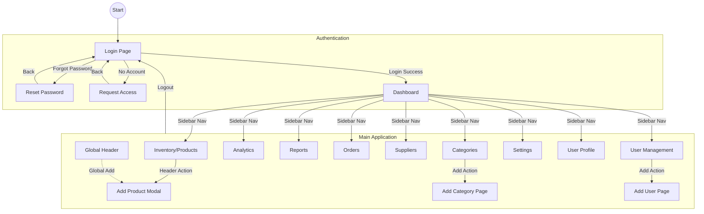

# InventPro Website Workflow & Connectivity

This document outlines the user flow and connectivity of pages within the InventPro application.

## High-Level Workflow Diagram

## Detailed Connectivity Matrix

| From Page | Action | To Page/Modal |
| :--- | :--- | :--- |
| **Login** | Sign In | Dashboard |
| **Login** | Forgot Password | Reset Password |
| **Login** | Request Access | Request Access |
| **Sidebar** | Navigation | Any Main Page |
| **Header** | Add Button (+) | Add Product (Modal) |
| **Categories** | Add Category | Add Category (Page/State) |
| **User Management** | Add User | Add User (Page/State) |
| **Add Product** | Close / Save | Inventory |

## Design Philosophy
The application follows a **Dark Luxury** aesthetic, utilizing:
- **Primary Colors**: Deep Black (`#050505`), Purple-600, Cyan-600.
- **Glassmorphism**: 40% opacity slates with heavy backdrop blurs.
- **Micro-interactions**: Framer Motion animations for transitions between states.
