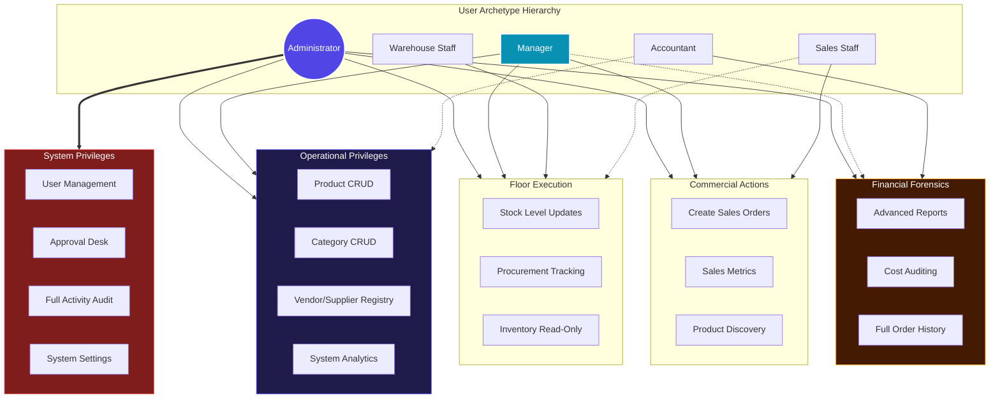

# InventPro Website Workflow & Connectivity

This document outlines the user flow and connectivity of pages within the InventPro application.

## High-Level Workflow Diagram

```mermaid
graph TD
    %% Entry Point
    Start((Start)) --> Login[Login Page]

    %% Authentication Flow
    subgraph Auth [Authentication]
        Login -->|Forgot Password| Reset[Reset Password]
        Login -->|No Account| Request[Request Access]
        Reset -->|Back| Login
        Request -->|Submit| Pending[Pending Approval Screen]
        Pending -->|Back| Login
        Login -->|Login Success| Dashboard[Dashboard]
    end

    %% Main Application Flow
    subgraph App [Main Application]
        Dashboard --> Inv[Products & Inventory]
        Dashboard --> Cat[Categories]
        Dashboard --> Ana[System Analytics]
        Dashboard --> Rep[Advanced Reports]
        Dashboard --> Ord[Sales & Orders]
        Dashboard --> Sup[Vendor Registry]
        Dashboard --> Users[User Database]
        Dashboard --> Admin[Admin Panel]
        Dashboard --> Approvals[Staff Requests]
        Dashboard --> Roles[Roles & Security]
        Dashboard --> Sett[Settings]
        Dashboard --> Prof[User Profile]

        %% Sub-pages & Modals
        Inv -->|Action| AddProd[Add Product Page]
        Inv -->|Action| ExportProd[Export CSV/PDF]
        
        Cat -->|Action| AddCat[Add Category Page]
        
        Ord -->|Action| AddOrd[Create Order Page]
        
        Sup -->|Action| AddSup[Add Supplier Page]
        
        Users -->|Action| AddUser[Add User Page]
        
        Admin -->|Analytics| DashboardStats[System Statistics]
        Admin -->|Monitoring| ActivityLogs[Activity Stream]
        
        Approvals -->|Action| ApproveRequest[Assign Role & Approve]
    end

    %% Logout
    App -->|Logout| Login
```

## Detailed Connectivity Matrix

| From Page | Action | To Page/Modal |
| :--- | :--- | :--- |
| **Login** | Sign In | Dashboard |
| **Login** | Forgot Password | Reset Password |
| **Login** | Request Access | Request Access |
| **Dashboard** | Navigation | Any Module |
| **Admin Panel** | View Stats | Dashboard Statistics |
| **Admin Panel** | Scrutiny | Activity Stream |
| **Inventory** | Export CSV/PDF | Download File |
| **Inventory** | Add Product | Add Product Page |
| **Categories** | Add Category | Add Category (Page) |
| **Orders** | Create Order | Add Order (Page) |
| **Suppliers** | Add Supplier | Add Supplier (Page) |
| **User Database** | Add User | Add User (Page) |
| **Roles & Security** | View Perms | Permission List |
| **Staff Requests** | Action | Assign Role & Approve |
| **Add Product** | Save | Products & Inventory |

## Website Logic & Algorithms

This section describes the conditional logic and "algorithms" that drive the InvenPro user experience across all modules.

### 1. Authentication & Access Algorithm
**Objective**: Control entry and identity within the application.

*   **Step 1**: User lands on `Login Page`.
*   **Step 2**: User enters credentials.
    *   **If Successful**: Server issues JWT -> Redirect to `Dashboard`.
    *   **If Failed**: Show "Invalid Credentials" error -> Stay on `Login Page`.
*   **Step 3**: User has no account?
    *   **Action**: Click "Request Access".
    *   **Flow**: Fill Request Form (Name, Email, Role) -> Submit -> `Wait for Admin Approval`.
*   **Step 4**: Forgot Password?
    *   **Action**: Click "Reset Password".
    *   **Flow**: Enter Email -> Verify Code -> Set New Password -> Return to `Login Page`.

### 2. Full Website Lifecycle (Module Flows)

#### A. Inventory & Categories (The Data Core)
*   **Adding Products**: 
    1. Click `Add Product` -> Open Modal.
    2. Input Details (Automated SKU generation or manual entry).
    3. **Logic**: Check if Category exists? 
       *   **Yes**: Linking to Category. 
       *   **No**: Prompt to create Category first in `Add Category`.
*   **Tracking**: Quantity falls below threshold -> Update Status to `Low Stock` (Cyan badge) or `Out of Stock` (Red badge).

#### B. Procurement & Sales (Suppliers & Orders)
*   **Supplier Onboarding**: `Suppliers` -> `Add Supplier`.
*   **Order Workflow**:
    1. `Orders` -> `Create Order`.
    2. Select `Product` + Select `Supplier`.
    3. **Automation**: Update product stock quantities once Order status is marked as `Received`.

#### C. Business Intelligence (Analytics & Reports)
*   **Analytics**: Fetches real-time data from MongoDB -> Calculates "Top Selling Categories" and "Total Inventory Value".
*   **Reports**: Generates detailed summaries (PDF/CSV) for weekly or monthly audits.

#### D. Administrative Control (Roles & Security)
*   **Approval Loop**:
    1. Admin navigates to `Staff Requests`.
    2. Review pending registrations.
    3. **Fields**: Name, Email, Requested Role, Message.
    4. **Actions**: 
        *   **Approve**: Assign final system role -> Create active account -> Trigger Credentials Notification.
        *   **Reject**: Deny access -> Request archived/rejected.
*   **Role Management**:
    *   **Admin**: Total system control, user management, activity monitoring.
    *   **Manager**: Inventory auditing, Supplier management, Analytical overviews.
    *   **Warehouse Staff**: Stock reconciliation, product updates, order processing.
    *   **Sales Staff**: Order creation, customer data, sales metrics.
    *   **Accountant**: Revenue tracking, purchase auditing, financial reports.

#### E. Security & Monitoring (Audit System)
*   **Activity Logging**:
    1. Every administrative action (Create/Edit/Delete/Approve) is tracked.
    2. **Tracking Fields**: `User ID`, `Action Type`, `Module`, `Timestamp`, `IP Address`.
    3. Admin reviews history in `Activity Stream` on the `Admin Panel`.

### 3. Settings & Personalization
*   **Profile**: Update name, bio, and profile picture.
*   **System Settings**: Toggle notifications, change theme preferences, or update business details.

---

## III. Role-Based Feature Workflows

This section defines the specific boundaries and capabilities granted to each user identity by the system administrator.

### Role-Based Permission Hierarchy
The following diagram illustrates how permissions are distributed and inherited across different user archetypes:

### 1. The Administrator (Full Authority)
**Objective**: Oversee system health, security, and staff lifecycle.
*   **Permissions**:
    *   **User Management**: Approve/Reject access requests, assign roles, reset user credentials.
    *   **Security Auditing**: Access to raw `Activity Logs` and `System Statistics`.
    *   **Database Control**: Full CRUD on Products, Categories, Suppliers, and Orders.
*   **Workflow**:
    1.  Monitor `Admin Panel` for system anomalies.
    2.  Check `Staff Requests` daily to onboard new employees.
    3.  Review `Activity Stream` to audit changes made by Managers or Staff.

### 2. The Manager (Operational Lead)
**Objective**: Drive inventory accuracy and procurement strategy.
*   **Permissions**:
    *   **Inventory Control**: Full CRUD on `Products` and `Categories`.
    *   **Vendor Management**: Manage `Supplier` registry and contact details.
    *   **Analytics**: View high-level `System Analytics` to identify trends.
*   **Workflow**:
    1.  Audit stock levels in `Inventory`.
    2.  Identify low-stock items -> Reach out to `Suppliers`.
    3.  Generate monthly `Reports` for the Admin.
*   **Restriction**: Cannot access User Database or Approval panels.

### 3. Warehouse Staff (Inventory Execution)
**Objective**: Ensure physical stock matches digital records.
*   **Permissions**:
    *   **Stock Updates**: Modify quantities and update stock status.
    *   **Read Access**: View `Products`, `Categories`, and `Suppliers`.
    *   **Order Tracking**: View procurement orders to reconcile arriving stock.
*   **Workflow**:
    1.  Receive shipment -> Locate item in `Products`.
    2.  Update quantity -> System automatically clears `Low Stock` badges.
    3.  Log physical discrepancies in the product notes.

### 4. Sales Staff (Outbound Flow)
**Objective**: Facilitate transactions and manage customer demand.
*   **Permissions**:
    *   **Order Creation**: Create and process sales `Orders`.
    *   **Product Lookup**: Search and filter `Inventory` for availability.
    *   **Sales Metrics**: View limited analytics related to sales performance.
*   **Workflow**:
    1.  Customer request -> Check `Product & Inventory` for stock.
    2.  Navigate to `Orders` -> `Create Order`.
    3.  System saves order -> Triggers stock deduction (Automated).

### 5. The Accountant (Financial Auditor)
**Objective**: Track revenue, costs, and audit financial trails.
*   **Permissions**:
    *   **Advanced Reports**: Full access to exportable financial summaries (PDF/CSV).
    *   **Cost Auditing**: View unit costs, supplier pricing, and total inventory value.
    *   **Order History**: Review all processed sales and purchases.
*   **Workflow**:
    1.  Navigate to `Advanced Reports`.
    2.  Filter by date range -> Export for tax/accounting software.
    3.  Audit `Suppliers` for pricing consistency.

---

## IV. Permission Matrix (Quick Reference)

| Feature | Admin | Manager | Warehouse | Sales | Accountant |
| :--- | :---: | :---: | :---: | :---: | :---: |
| **Approve Users** | ✅ | ❌ | ❌ | ❌ | ❌ |
| **Delete Products** | ✅ | ✅ | ❌ | ❌ | ❌ |
| **Edit Stock Levels** | ✅ | ✅ | ✅ | ❌ | ❌ |
| **Create Orders** | ✅ | ✅ | ❌ | ✅ | ❌ |
| **View Profit/Cost** | ✅ | ✅ | ❌ | ❌ | ✅ |
| **System Settings** | ✅ | ❌ | ❌ | ❌ | ❌ |
| **Activity Logs** | ✅ | ❌ | ❌ | ❌ | ❌ |

---

## Technical Flow Summary
1.  **Request**: User interacts with React Frontend.
2.  **Authentication**: Middleware checks for valid JWT.
3.  **Action**: Backend (Node/Express) processes business logic.
4.  **Persistence**: Data is saved/retrieved from MongoDB.
5.  **Feedback**: React updates state via `AppContext` and displays Toast notifications.

---

## Design Philosophy
The application follows a **Dark Luxury** aesthetic, utilizing:
- **Primary Colors**: Deep Black (`#050505`), Purple-600, Cyan-600.
- **Glassmorphism**: 40% opacity slates with heavy backdrop blurs.
- **Micro-interactions**: Framer Motion animations for transitions between states.
