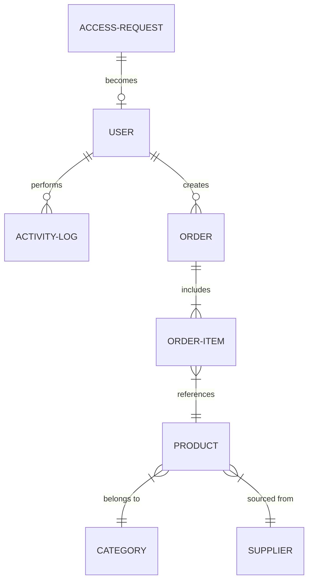

# InventPro Technical Specification

## 1. DATASET STRUCTURE PER MODULE

### 1.1 Dashboard (System Visualizer)
The Dashboard provides real-time statistics and KPI metrics by aggregating data from across the system.

| Field | Type | Validation / Constraints | Default Value | Description |
| :--- | :--- | :--- | :--- | :--- |
| `totalStockValue` | Number | Non-negative | 0 | Sum of (CostPrice * Qty) for all products |
| `lowStockCount` | Integer | Non-negative | 0 | Count of products with Qty < Threshold |
| `totalOrdersToday` | Integer | Non-negative | 0 | Count of orders created today |
| `activeUsersCount` | Integer | Non-negative | 0 | Count of users with 'active' status |
| `recentActivity` | Array | Latest 10 entries | [] | List of recent system actions |

**Sample Data Structure (JSON)**
```json
{
  "metrics": {
    "totalStockValue": 450000.50,
    "lowStockCount": 12,
    "totalOrdersToday": 25,
    "activeUsersCount": 8
  },
  "recentActivity": [
    { "user": "Admin", "action": "Approved Request", "time": "2024-03-18T10:00:00Z" }
  ]
}
```

---

### 1.2 Admin Panel (Control Center)
The Admin Panel tracks system-wide health and activity logs.

| Field | Type | Validation / Constraints | Default Value | Description |
| :--- | :--- | :--- | :--- | :--- |
| `serverId` | String | Unique | "srv-001" | Identifier for the primary server instance |
| `uptime` | String | Duration format | "0d 0h 0m" | Total system uptime |
| `dbStatus` | String | Enum: Connected, Disconnected | "Connected" | Status of MongoDB connection |
| `activityLogs` | Array | Ref: `ActivityLog` model | [] | Collection of historical audit logs |

**Sample Data Structure (JSON)**
```json
{
  "systemHealth": {
    "dbStatus": "Connected",
    "latency": "45ms",
    "activeThreads": 4
  }
}
```

---

### 1.3 Products & Inventory (13 Fields)
Core module for managing physical goods and stock levels. Based on `product.model.js`.

| Field | Type | Validation / Constraints | Default Value | Description |
| :--- | :--- | :--- | :--- | :--- |
| `productName` | String | Required, Min 3 chars | - | Full name of the product |
| `productDescription`| String | - | - | Detailed description |
| `category` | Array(String) | Must match existing categories | [] | List of tags for grouping |
| `brand` | String | - | - | Manufacturer brand |
| `skuId` | String | Unique, Alphanumeric | - | Stock Keeping Unit identifier |
| `barcodeEAN` | String | - | - | European Article Number |
| `initialQty` | Number | Non-negative | 0 | Current quantity in stock |
| `lowStockThreshold`| Number | Non-negative | 10 | Level at which alert is triggered |
| `productImage` | String | URL or Base64 | - | Visual thumbnail |
| `basePrice` | Number | Required, > 0 | - | Selling price per unit |
| `costPrice` | Number | - | - | Purchase cost (not visible to users) |
| `tax` | Number | Non-negative | 0 | Tax percentage (%) |
| `status` | String | Enum: 'in stock', 'low stock', 'out of stock' | 'in stock' | Availability status |

**Sample Data Structure (JSON)**
```json
{
  "productName": "Wireless Mouse G501",
  "productDescription": "Ergonomic wireless gaming mouse with RGB.",
  "category": ["Electronics", "Peripherals"],
  "brand": "Logitech",
  "skuId": "MOU-LOG-123",
  "barcodeEAN": "1234567890123",
  "initialQty": 55,
  "lowStockThreshold": 5,
  "productImage": "https://example.com/mouse.png",
  "basePrice": 49.99,
  "costPrice": 30.00,
  "tax": 18,
  "status": "in stock"
}
```

---

### 1.4 Staff Requests (Access Workflow)
Handles onboarding of new staff members. Based on `accessRequest.model.js`.

| Field | Type | Validation / Constraints | Default Value | Description |
| :--- | :--- | :--- | :--- | :--- |
| `fullName` | String | Required | - | Applicant's name |
| `email` | String | Unique, Valid Email | - | Contact email for credentials |
| `phone` | String | - | - | Contact phone number |
| `department` | String | - | - | Assigned department |
| `requestedRole` | String | Enum: admin, manager, staff, etc. | 'staff' | Desired access level |
| `message` | String | Max 500 chars | - | Request justification |
| `status` | String | Enum: pending, approved, rejected | 'pending' | Processing status |
| `adminNotes` | String | - | - | Feedback from administrator |

---

### 1.5 User Database (Auth & Profiles)
Stores active user accounts. Based on `auth.model.js`.

| Field | Type | Validation / Constraints | Default Value | Description |
| :--- | :--- | :--- | :--- | :--- |
| `fullName` | String | Required | - | User's display name |
| `email` | String | Unique, Required | - | Login identifier |
| `phone` | String | - | - | Contact number |
| `password` | String | Hashed, Required | - | Encrypted credential |
| `confirmPassword` | String | Must match password | - | Verification field |
| `role` | String | Enum: admin, manager, staff, etc. | 'staff' | RBAC control |
| `status` | String | Enum: pending, active, rejected | 'pending' | Account usability status |
| `resetOtp` | String | 6 digits | - | Password recovery code |
| `otpExpires` | Date | - | - | OTP validity period |
| `isOtpVerified` | Boolean | - | false | Verification state |

---

### 1.6 Roles & Security (RBAC)
Defines what each user archetype can perform. Based on `role.model.js`.

| Field | Type | Validation / Constraints | Default Value | Description |
| :--- | :--- | :--- | :--- | :--- |
| `name` | String | Unique, Enum | - | 'admin', 'manager', 'sales', etc. |
| `permissions` | Array | Enum: create_product, manage_users, etc. | [] | List of capability strings |
| `description` | String | - | - | Summary of role responsibilities |

---

### 1.7 Item Categories
Organizes products into logical hierarchies.

| Field | Type | Validation / Constraints | Default Value | Description |
| :--- | :--- | :--- | :--- | :--- |
| `catName` | String | Required, Unique | - | Visual name of category |
| `slug` | String | Auto-generated from name | - | URL-friendly identifier |
| `description` | String | - | - | Category details |
| `status` | String | Enum: active, inactive | 'active' | Visibility state |
| `parent` | String | Ref: `Category` slug | 'none' | Hierarchical parent |
| `thumbnail` | String | URL or Base64 | - | Icon/Image for the category |

---

### 1.8 Sales & Orders
Tracks transactions. Based on `order.model.js`.

| Field | Type | Validation / Constraints | Default Value | Description |
| :--- | :--- | :--- | :--- | :--- |
| `orderId` | String | Unique | - | "ORD-YYYY-XXXX" format |
| `date` | String | YYYY-MM-DD | - | Transaction date |
| `time` | String | HH:MM AM/PM | - | Transaction time |
| `type` | String | Enum: inward, outward | - | Direction of stock flow |
| `entity` | String | Supplier or Customer name | - | Related third party |
| `items` | String | Summary string (e.g. "5 items") | - | Order contents description |
| `value` | String | Formatted currency (e.g. "$600.00") | - | Total order value |
| `status` | String | Enum: completed, processing, pending | 'pending' | Fulfillment state |

---

### 1.9 Vendor Registry (Suppliers)
Based on `supplier.model.js`.

| Field | Type | Validation / Constraints | Default Value | Description |
| :--- | :--- | :--- | :--- | :--- |
| `company` | String | Required | - | Vendor commercial name |
| `code` | String | Unique, Required | - | Internal supplier code |
| `contact` | String | - | - | Primary contact person |
| `email` | String | Valid Email | - | Contact email |
| `phone` | String | - | - | Contact phone |
| `categories` | Array(String) | - | [] | Scopes supplied by vendor |
| `status` | String | Enum: Active, Inactive | 'Active' | Vendor availability |
| `reliability` | Number | 0 to 100 | 100 | Performance score |
| `location` | String | - | - | Warehouse/Office location |

---

### 1.10 System Analytics
Calculated metrics for business intelligence.

| Field | Type | Validation / Constraints | Default Value | Description |
| :--- | :--- | :--- | :--- | :--- |
| `trendData` | Array | Monthly aggregations | [] | Data points for area charts |
| `topSelling` | Array | Sorted by volume | [] | Best performing items |
| `stockTurns` | Number | Calculated ratio | 0 | Inventory turnover speed |

---

### 1.11 Advanced Reports
Configurations for scheduled data exports.

| Field | Type | Validation / Constraints | Default Value | Description |
| :--- | :--- | :--- | :--- | :--- |
| `reportType` | String | Inventory, Sales, Audit | - | Dataset scope |
| `schedule` | String | Daily, Weekly, Monthly | 'Monthly' | Frequency of generation |
| `format` | String | PDF, CSV, Excel | 'PDF' | Output file type |

---

### 1.12 System Settings
Global application control flags.

| Field | Type | Validation / Constraints | Default Value | Description |
| :--- | :--- | :--- | :--- | :--- |
| `orgName` | String | Max 50 chars | "InventPro" | Organization display name |
| `currency` | String | ISO Code | "USD" | Default financial unit |
| `notifEmail` | String | Valid Email | - | Recipient for system alerts |

---

## 2. STATE MANAGEMENT & API ARCHITECTURE

### Redux Toolkit (RTK) Global Store
Enterprise-grade state management replacing legacy Context API for high-performance and data consistency.

- **`authSlice`**: Manages `user` session, `token`, and `isAuthenticated` status. Persisted via `redux-persist`.
- **`uiSlice`**: Manages application-wide UI states including `modals` (Add Product, Stock Adjust), `sidebar` toggle, and `activeTab`.
- **`productSlice`**: Manages inventory filters, search queries, and local pagination state.

### RTK Query (API Slices)
Automated data fetching with centralized caching, invalidation logic, and optimized polling.

| Slice | Module Access | Invalidation Tags |
| :--- | :--- | :--- |
| `authApi` | Login, Register, Request Access, User Profile | `['User']` |
| `productApi` | Products, Stock Levels, Metadata | `['Products']` |
| `orderApi` | Sales, Transactions, Status Updates | `['Orders']` |
| `reportApi` | Analytics, Trends, Summary Stats | `['Reports']` |
| `settingsApi` | System Settings, Infrastructure Stats | `['Settings']` |
| `activityApi` | Audit Logs, Global Activity Stream | `['Activity']` |

### Cache Invalidation Patterns
- **Mutations** (Add/Edit/Delete): Trigger specific tag invalidations to force UI synchronization.
- **Polling**: High-frequency modules (Dashboard Stats) use 30s polling intervals.
- **Optimistic Updates**: Implemented on low-latency interactions (Stock Adjustment) for perceived speed.

---

## 3. TECHNICAL SPECIFICATIONS

### Authorization Rules
- **Admin**: Full control over all 12 modules.
- **Manager**: Products, Categories, Suppliers, Orders (Full CRUD).
- **Warehouse Staff**: Inventory (Stock Level Update, Product View).
- **Sales Staff**: Order Creation, Inventory View.
- **Accountant**: Financial Reporting, Order History View.

### Relationship Diagram

