# InventPro — UI/UX Design Synopsis

---

## Abstract

InventPro is a next-generation, enterprise-grade inventory management system designed with a singular creative vision: **"Operational Elegance."** In an industry historically dominated by cluttered, utilitarian spreadsheet-style software, InventPro challenges the status quo by fusing deep functionality with a visually sophisticated **Dark Luxury** aesthetic. The application is not merely a tool — it is an environment designed to reduce cognitive friction, improve data legibility, and create a measurable sense of professional empowerment for every user who interacts with it.

At its core, InventPro's UI is built using **React 19 (Vite)** and **Tailwind CSS 4**, two of the most modern frontend technologies available. The design philosophy is centered around the principle that **beautiful software is more usable software** — a concept derived from the well-documented *Aesthetic-Usability Effect* in Human-Computer Interaction (HCI). Visual hierarchy is established through a curated, high-contrast color palette where deep blacks provide the canvas and electrifying purple and cyan tones provide meaning and urgency. Motion is managed by **Framer Motion**, which breathes life into every transition, page load, and modal interaction.

The result is an application that feels unlike any traditional inventory system — it feels like a premium command center. Whether a warehouse manager is performing a stock audit or an administrator is reviewing access requests, every pixel has been purposefully positioned to make the process faster, clearer, and more satisfying. This synopsis documents the complete UI/UX strategy, color system, typographic approach, design principles, and experiential architecture that brings InventPro's interface to life.

---

## Introduction

The foundational idea behind InventPro's interface design is the concept of **"System Intelligence"** — a visual metaphor borrowed from high-tech control rooms, aviation HUDs, and premium automotive dashboards. Rather than presenting raw database records, the UI transforms data into a living, breathing, real-time narrative. When a user logs in, they are greeted with a dashboard (`Dashboard.jsx`) that feels like stepping into a mission control center: animated KPI cards fade in with staggered delays, glowing line charts pulse against the dark canvas, and the sidebar navigation presents itself as a clean hierarchy of purpose.

The introduction of this design discipline required rejecting conventional web frameworks that impose light, airy aesthetics. InventPro uses an absolute black foundation (`#050505` in `App.jsx` and `Login.jsx`) as the primary surface — a canvas borrowed from OLED display engineering — to achieve maximum contrast ratios for text, icons, and data. This is not stylistic preference alone; it is a physiological decision. Studies in HCI confirm that high-contrast dark interfaces significantly reduce eye strain during extended work sessions, which is critical for warehouse staff and administrators who may use the system for eight or more hours per day.

The introduction of **Framer Motion** animations (`motion.div`, `AnimatePresence`) ensures that the UI never feels static. Every component entry — from stat cards to audit log rows — is orchestrated through `initial`, `animate`, and `transition` properties, creating a choreographed experience that communicates system responsiveness and precision. The interface is designed not to be noticed, but to be felt effortlessly.

---

## Motivation

The motivation for InventPro's UI/UX strategy stems from a critical analysis of existing inventory management tools and the significant **"Experience Gap"** they exhibit. Enterprise solutions like SAP or older Oracle-based systems were built in an era when every pixel was a computational expense. This led to decades of "form-dense" design culture — where function was celebrated and aesthetics were actively deprioritized. The result: professionals operate daily in environments that feel hostile, visually noisy, and mentally fatiguing.

We believed this was unacceptable. The modern professional workforce — particularly in supply chain and retail — deserves software that respects their focus and reduces the number of decisions they must make visually. This motivated the **Dark Luxury** design direction: a theme where every color has semantic meaning, every shadow communicates depth, and every animation communicates intent. Physiologically, the deep black background (`#050505`) minimizes blue light exposure, which is linked to reduced melatonin suppression during late shifts. Psychologically, the use of purple and cyan accents — which carry cultural associations with premium technology brands — subtly reinforces a user's confidence in the system they are operating.

The use of **Glassmorphism** (20–40px backdrop blurs with semi-transparent slate surfaces) was motivated by the desire to create depth without distraction. Active panels "float" above the background data, communicating importance through physics rather than color alone. Every motivational design decision points toward one goal: an interface that makes complex operations feel simple, urgent, and worth the user's full attention.

---

## Why This Project?

The "why" behind InventPro's UI/UX approach is rooted in a principle from cognitive psychology known as **"Hierarchy of Information."** Traditional systems present all data at the same visual weight — every row in a table, every label on a form, looks equally important. This forces the user's brain to work overtime to prioritize what requires action. InventPro solves this by using its color and contrast system as a semantic communication layer.

For example, in the `Dashboard.jsx`, the **Emerald-500** (`#10b981`) color is exclusively reserved for positive trends and successful states. **Amber-500** (`#f59e0b`) is used for warnings like low stock and pending approvals. **Red-500** (`#ef4444`) signals critical failures and dangerous actions like logout confirmation. This consistent semantic mapping means that after just a few minutes of use, a user's eye naturally gravitates to the colors it needs without conscious effort.

The project also exists to demonstrate that **MERN stack applications** are not limited to functional CRUD interfaces. By choosing **Tailwind CSS 4** for its design token system and **React 19** for concurrent rendering, InventPro proves that web applications can match the performance and visual fidelity of native desktop software. The sidebar (`Sidebar.jsx`) exemplifies this: active navigation links use a `bg-linear-to-r from-purple-500/20 to-cyan-500/20` gradient border — a detail that is simultaneously decorative and functional, clearly marking the user's current location in the system architecture.

---

## Objectives & Goals

### Primary UI/UX Goals

The primary objective of InventPro's UI/UX design is to achieve **Frictionless Operational Oversight** — ensuring that a user can access any critical piece of information within two interactions from any screen. This was accomplished through four core design mandates:

1. **Instant Visual Feedback:** Every interactive element responds immediately. Buttons animate with `whileHover={{ scale: 1.05 }}` and `whileTap={{ scale: 0.95 }}` from Framer Motion (as seen in `Login.jsx`), confirming to the user that the system has registered their intent before the server even responds.
2. **Semantic Color Coding:** The full 15-color palette (documented in the Colors section) is applied in a rule-based manner. Users learn the system's "language" within the first session, dramatically reducing navigation time in subsequent use.
3. **Progressive Disclosure:** Complex modules like `AuditLogs.jsx` hide advanced filters behind collapsible panels, presenting only the most critical information by default. This follows Donald Norman's principle of "simplicity in the surface, power underneath."
4. **Data-as-Story:** Rather than raw numbers, the dashboard uses **Recharts** integration to visualize stock movement, distribution, and throughput as animated charts, transforming business data into actionable visual narratives.

### Secondary UI/UX Goals

Secondary goals focus on the "delight layer" of the experience: micro-interactions like the sidebar nav dot indicator (`shadow-[0_0_8px_rgba(168,85,247,0.5)]`) and the notification ticker built into the `Header.jsx` that scrolls live audit events in real-time — a feature that makes the system feel alive and continuously aware.

---

## Background

The design background of InventPro is rooted in the academic study of **Human-Computer Interaction (HCI)** and the evolution of the "Dashboard" as a design paradigm. The concept of the dashboard — presenting multiple metrics simultaneously in a glanceable format — originated in aviation with aircraft instrument panels. Modern web dashboards borrowed this concept but often lost the critical clarity principle: each instrument should communicate one thing, and communicate it instantly.

InventPro studied the design trajectories of leading enterprise tools — from Vercel's deployment dashboard to Linear's project management interface — and identified the common thread: **dark themes with high-luminance accents win in data-dense environments.** Both tools use dark foundations with selective use of color to draw the user's eye. We applied this principle rigorously: the `#050505` base ensures that the `#8b5cf6` (Purple-500) accent requires zero additional "help" to stand out. It simply glows against the darkness.

The background research also validated **Glassmorphism** as the correct depth-management technique for this project. By using `bg-slate-900/40` (40% opacity Slate-900) combined with `backdrop-blur-sm` or `backdrop-blur-2xl` (as seen in the login card and notification box), components achieve a physical materiality — they appear to exist above the surface rather than being flat stickers on a screen. This depth layer is the primary mechanism through which InventPro communicates "this panel is active and requires your focus."

---

## Tools & Platforms

### Hardware Recommendations

InventPro's UI is optimized for environments that can do justice to its visual fidelity. **OLED or high-quality IPS panels** are strongly recommended, as the deep `#050505` background achieves true black only on OLED displays — the contrast ratio on such screens is effectively infinite, making the purple and cyan accents appear to emit their own light. For floor staff, **10-inch tablets** with multi-touch support are the ideal form factor, as all interactive elements maintain a minimum touch target of 44×44px per WCAG 2.1 guidelines. High-performance workstations with multi-monitor setups benefit from InventPro's responsive grid layout, which adapts from single-column mobile views to 4-column desktop grids using Tailwind's `md:` and `lg:` breakpoints.

### Software Stack

- **React 19 (Vite):** Concurrent rendering eliminates the "waterfall rendering" that makes data-heavy dashboards feel sluggish.
- **Tailwind CSS 4:** Utility-first system with JIT compilation, used for every layout, spacing, and color decision.
- **Framer Motion:** Powers all entrance animations (`opacity: 0 → 1`, `y: 20 → 0`) and interactive micro-responses.
- **Recharts:** SVG-based chart library for all `AreaChart` (Admin Dashboard), `LineChart`, and `PieChart` (Dashboard) components.
- **Lucide React:** Minimal, consistent 24×24px icon set: `Package`, `ShieldCheck`, `History`, `BarChart3`, `ArrowUpDown` — all used throughout the sidebar and page headers.
- **React Hot Toast:** Notification system styled to match the dark theme (`background: #0f172a`, `border: 1px solid #1e293b`) as configured in `App.jsx`.

---

## The Complete Color System

InventPro uses a rigorously defined, purpose-built color palette extracted directly from the frontend codebase (`App.jsx`, `Login.jsx`, `Dashboard.jsx`, `AdminDashboard.jsx`, `Sidebar.jsx`, `SideNavLinks.jsx`, `AuditLogs.jsx`, `Header.jsx`). Every color serves a semantic role — there are no decorative colors used without meaning. The system is divided into four groups: **Foundations**, **Brand Accents**, **Semantic States**, and **Surface/Glass Layers**.

### Group 1: Foundation Colors (The Canvas)

These are the absolute base colors that form the visual ground of every page and panel.

| # | Name | Hex / Value | Where Used |
|---|------|-------------|-----------|
| 1 | Deep Space Black | `#050505` | Main `
` background in `App.jsx`, `Login.jsx` — the absolute base of the entire application |
| 2 | Vantablack Grey | `#0a0a0a` | Sidebar (`Sidebar.jsx`) and Header (`Header.jsx`) backgrounds — creates a perceptible layer above the page base |

### Group 2: Brand Accent Colors (The Voice)

These two colors define InventPro's brand identity and are used consistently across every page to signal interactive elements and brand presence.

| # | Name | Hex | Where Used |
|---|------|-----|-----------|
| 3 | Purple-500 (Brand Primary) | `#8b5cf6` | ClipLoader in `App.jsx`, chart lines in `Dashboard.jsx` & `AdminDashboard.jsx`, active nav dot in `SideNavLinks.jsx`, gradient fill in `AuditLogs.jsx` active pagination, icon color in `AuditLogs.jsx` module column |
| 4 | Purple-600 (Brand Deep) | `#7c3aed` | Login button gradient `from-purple-600` in `Login.jsx` |
| 5 | Indigo-600 (Brand Gradient End) | `#4f46e5` | Login button gradient `to-indigo-600` in `Login.jsx` — paired with Purple-600 for the CTA button |
| 6 | Cyan-500 (Secondary Accent) | `#06b6d4` | "Sold" line in `Dashboard.jsx` charts, `sync`-type activity indicator in `AdminDashboard.jsx` |
| 7 | Cyan-400 (Interactive Hover) | `#22d3ee` | Hover state for sidebar icons in `SideNavLinks.jsx`, "Register Admin" link in `Login.jsx` |
| 8 | Purple-400 (Soft Accent) | `#a78bfa` | Icon color for active nav items in `SideNavLinks.jsx`, input icon focus state in `Login.jsx` & `AuditLogs.jsx`, `auth`-type log indicator in `AdminDashboard.jsx` |

### Group 3: Semantic State Colors (The Language)

These colors communicate system states — success, warning, danger — through a consistent and learnable visual grammar across all pages.

| # | Name | Hex | Semantic Role | Where Used |
|---|------|-----|---------------|-----------|
| 9 | Emerald-500 (Success) | `#10b981` | Verified/success states | Trend badge in `Dashboard.jsx`, "grant" activity indicator in `AdminDashboard.jsx`, verified status in `AuditLogs.jsx` |
| 10 | Emerald-400 (Success Text) | `#34d399` | Positive text labels | Trend percentages in `Dashboard.jsx` & `AdminDashboard.jsx` stat cards, DB Sync metric in `AdminDashboard.jsx` |
| 11 | Amber-500 (Warning) | `#f59e0b` | Caution / Low-stock alerts | "warning" activity type in `Dashboard.jsx`, "security" event type in `AdminDashboard.jsx`, Daily Revenue icon in `AdminDashboard.jsx` |
| 12 | Amber-400 (Warning Text) | `#fbbf24` | Warning labels | `AdminDashboard.jsx` Latency metric text |
| 13 | Red-500 (Danger) | `#ef4444` | Destructive / critical | "danger" activity type in `Dashboard.jsx`, Logout hover state `hover:text-red-400 hover:bg-red-500/10` in `Sidebar.jsx` |

### Group 4: Surface & Glass Layer Colors (The Depth)

These colors create the layered, glass-like materiality that defines the Glassmorphism design system.

| # | Name | Hex / Value | Where Used |
|---|------|-------------|-----------|
| 14 | Slate-900 Deep Surface | `#0f172a` | Tooltip background in `Dashboard.jsx` charts, Toast notification background in `App.jsx`, `bg-slate-950/80` on input fields in `Login.jsx` |
| 15 | Slate-900 Glass Panel | `rgba(15,23,42, 0.4)` | All major cards in `Dashboard.jsx`, `AdminDashboard.jsx`, `AuditLogs.jsx` — the `bg-slate-900/40` class creates the frosted glass surface |
| 16 | Slate-800 Border | `#1e293b` | All card borders (`border-slate-800`), chart grid lines in `Dashboard.jsx` & `AdminDashboard.jsx`, input borders in `Login.jsx` |
| 17 | Slate-700 Internal Border | `#334155` | Tooltip borders in chart components, inner card hover borders in `AdminDashboard.jsx` & `AuditLogs.jsx` |
| 18 | Slate-600 Dark Text | `#475569` | Timestamp labels in `AuditLogs.jsx`, ultra-muted metadata text |
| 19 | Slate-500 Inactive | `#64748b` | Chart axis labels in `Dashboard.jsx` & `AdminDashboard.jsx`, sidebar inactive icon color, placeholder/secondary text in `Sidebar.jsx` |
| 20 | Slate-400 Body Text | `#94a3b8` | Activity descriptions, metadata, secondary labels throughout all pages |
| 21 | Slate-300 Highlighted Text | `#cbd5e1` | Notification ticker text in `Header.jsx` — one step above muted |
| 22 | White (Primary Text) | `#ffffff` | All heading text (`text-white`), critical values, stat numbers |

**Total: 22 distinct colors used across the InventPro frontend.** Each one is deliberate, semantic, and non-redundant within the design system.

---

## Website Page Flow & Connectivity

The following diagram is a complete **screen-by-screen user journey** — every page a user lands on, every decision they face, and every page they navigate to next, from first visit all the way through to logout.

```mermaid
flowchart TD
    Start(["🌐 User Opens Browser"]) --> LP

    %% ════════════════════════════════════════════════════
    %% SCREEN 1 — LOGIN PAGE
    %% ════════════════════════════════════════════════════
    subgraph S1 ["📍 Screen 1 — /login   (Entry Point)"]
        direction TB
        LP["🔐 Login Page\nEnter Email + Password"]
        LP --> AuthCheck{"Valid\nCredentials?"}
        AuthCheck -->|"❌ Wrong password / email"| LoginErr["❌ Error Toast shown\n'Invalid Credentials'"]
        LoginErr --> LP
        AuthCheck -->|"✅ Correct"| StatusCheck{"Account\nStatus?"}
        StatusCheck -->|"⏳ Pending"| PendingMsg["⏳ 'Awaiting Approval'\nCannot log in yet"]
        PendingMsg --> LP
        StatusCheck -->|"❌ Inactive"| InactiveMsg["❌ 'Account Inactive'\nContact Administrator"]
        InactiveMsg --> LP
        StatusCheck -->|"✅ Active"| JWTIssued["🔑 JWT Token Issued\nSession Started"]
    end

    %% ════════════════════════════════════════════════════
    %% FORGOT PASSWORD FLOW
    %% ════════════════════════════════════════════════════
    LP -->|"Click 'Forgot Password?'"| FP1

    subgraph S2 ["📍 Screen 2 — /reset-password   (Forgot Password Flow)"]
        direction TB
        FP1["📧 Step 1 — Enter Registered Email"]
        FP1 --> EmailCheck{"Email exists\nin system?"}
        EmailCheck -->|"❌ Not registered"| EmailErr["❌ Error: 'Email not found'"]
        EmailErr --> FP1
        EmailCheck -->|"✅ Found"| OTPSent["📨 OTP (4-digit code)\nsent to email"]

        OTPSent --> FP2["🔢 Step 2 — Enter OTP\n(received in email)"]
        FP2 --> OTPCheck{"OTP\nvalid?"}
        OTPCheck -->|"❌ Wrong code"| OTPErr["❌ Error: 'Invalid OTP'\n(max 3 attempts)"]
        OTPErr --> FP2
        OTPCheck -->|"⌛ Expired"| OTPExp["⌛ 'OTP Expired'\nRequest new code"]
        OTPExp --> FP1
        OTPCheck -->|"✅ Correct"| FP3

        FP3["🔒 Step 3 — Enter New Password\n+ Confirm Password"]
        FP3 --> PassCheck{"Passwords\nmatch?"}
        PassCheck -->|"❌ No match"| PassErr["❌ 'Passwords do not match'"]
        PassErr --> FP3
        PassCheck -->|"✅ Match"| PassSaved["✅ Password Updated!\nSuccess Message"]
        PassSaved -->|"Auto-redirect to login"| LP
    end

    %% ════════════════════════════════════════════════════
    %% REQUEST ACCESS FLOW
    %% ════════════════════════════════════════════════════
    LP -->|"Click 'Request Access'"| RA1

    subgraph S3 ["📍 Screen 3 — /request-access   (New User Onboarding)"]
        direction TB
        RA1["📝 Fill Request Form\nFull Name · Email · Message"]
        RA1 --> UserExists{"Already\nregistered?"}
        UserExists -->|"✅ Yes — go to login"| LP
        UserExists -->|"❌ New user"| RA_Submit["📬 Request Submitted\n(Status: Pending)"]
        RA_Submit --> AdminEmail["📧 Admin receives\n'New Request' notification email"]
        RA_Submit --> UserEmail["📧 User receives\n'Request received' confirmation"]
        AdminEmail --> AdminDecision{"Admin reviews\nin Approval Desk"}
        AdminDecision -->|"✅ Approve\n+ Assign Role"| Approved["✅ Account Activated!\nApproval email sent to user"]
        AdminDecision -->|"❌ Reject\n+ Add reason"| Rejected["❌ Rejection email\nsent to user"]
        Approved --> LP
        Rejected --> LP
    end

    %% ════════════════════════════════════════════════════
    %% ADMIN REGISTRATION FLOW
    %% ════════════════════════════════════════════════════
    LP -->|"Click 'Register as Admin'"| AR1

    subgraph S4 ["📍 Screen 4 — /register-admin   (Admin Registration)"]
        direction TB
        AR1["🛡️ Admin Register Form\nName · Email · Phone · Password · Confirm Password"]
        AR1 --> AdminLimit{"Fewer than\n2 admins exist?"}
        AdminLimit -->|"❌ Limit reached (2/2)"| AdminErr["❌ 'Max admin limit reached'\nCannot register"]
        AdminErr --> AR1
        AdminLimit -->|"✅ Slot available"| AR_Created["✅ Admin Account Created\nSuccess Message"]
        AR_Created -->|"Redirect to login"| LP
    end

    %% ════════════════════════════════════════════════════
    %% POST-LOGIN — DASHBOARD (Central Hub)
    %% ════════════════════════════════════════════════════
    JWTIssued -->|"Redirect based on role"| DB

    subgraph S5 ["📍 Screen 5 — /dashboard   (Post-Login Hub — All Roles)"]
        direction TB
        DB["📊 Dashboard\nKPI Cards · Stock Charts · Recent Activity Feed"]
    end

    %% ════════════════════════════════════════════════════
    %% SIDEBAR PAGES REACHABLE FROM DASHBOARD
    %% ════════════════════════════════════════════════════
    DB -->|"Sidebar"| INV["📦 /inventory\nProducts & Stock List\n(All Roles — view; Admin/Manager — edit/delete)"]
    DB -->|"Sidebar"| CAT["🏷️ /categories\nItem Categories\n(Admin · Manager · Warehouse Staff)"]
    DB -->|"Sidebar"| ORD["🛒 /orders\nSales & Orders\n(Admin · Manager · Sales Staff)"]
    DB -->|"Sidebar"| SUP["🏭 /suppliers\nVendor Registry\n(Admin · Manager · Accountant)"]
    DB -->|"Sidebar"| ANA["📈 /analytics\nCharts & Business Trends\n(Admin · Manager · Accountant)"]
    DB -->|"Sidebar"| REP["📑 /reports\nExport Reports — PDF / CSV\n(Admin · Manager · Accountant)"]
    DB -->|"Sidebar"| AUD["📋 /audit\nAudit Logs\n(All Roles — RBAC filtered)"]
    DB -->|"Header Avatar"| PRO["👤 /profile\nEdit Name · Bio · Avatar\n(All Roles)"]
    DB -->|"Sidebar — Admin Only"| ADM["🖥️ /admin-dashboard\nSystem Health · DB Status · Live Metrics"]
    DB -->|"Sidebar — Admin Only"| USR["👥 /users\nUser Management — View/Edit/Delete Users"]
    DB -->|"Sidebar — Admin Only"| APP["✅ /approvals\nApproval Desk — Pending Access Requests"]
    DB -->|"Sidebar — Admin Only"| SET["⚙️ /settings\nOrg Name · Currency · Notification Email"]
    DB -->|"Sidebar — Admin Only"| ROL["🛡️ /roles\nRoles & Permissions — RBAC Config"]

    %% ════════════════════════════════════════════════════
    %% CRUD SUB-PAGES
    %% ════════════════════════════════════════════════════
    INV -->|"'Add Product' button"| AP["➕ Add Product Modal\nName · SKU · Price · Stock · Image"]
    AP -->|"✅ Save"| INV
    AP -->|"❌ Cancel"| INV

    CAT -->|"'Add Category' button"| AC["➕ /add-category\nCategory Name · Thumbnail · Parent"]
    AC -->|"✅ Save"| CAT
    AC -->|"❌ Cancel"| CAT

    ORD -->|"'New Order' button"| AO["➕ /add-order\nSelect Products · Customer · Quantity"]
    AO -->|"✅ Confirm Order"| ORD
    AO -->|"❌ Cancel"| ORD

    SUP -->|"'Add Supplier' button"| AS["➕ /add-supplier\nCompany · Code · Contact · Reliability"]
    AS -->|"✅ Save"| SUP
    AS -->|"❌ Cancel"| SUP

    USR -->|"'Add User' button"| AU["➕ /add-user\nName · Email · Role · Status"]
    AU -->|"✅ Created"| USR
    AU -->|"❌ Cancel"| USR

    ROL -->|"'Create Role' button"| AR["➕ /add-role\nRole Name · Permissions Checklist"]
    AR -->|"✅ Save"| ROL
    AR -->|"❌ Cancel"| ROL

    %% ════════════════════════════════════════════════════
    %% APPROVAL DESK FLOW
    %% ════════════════════════════════════════════════════
    APP -->|"✅ Approve User → Assign Role"| USR
    APP -->|"❌ Reject → Send notification"| APP

    %% ════════════════════════════════════════════════════
    %% CROSS-PAGE LINKS
    %% ════════════════════════════════════════════════════
    DB -->|"'View All Activity' link"| AUD
    ADM -->|"'View Audit Trail' link"| AUD

    %% ════════════════════════════════════════════════════
    %% LOGOUT
    %% ════════════════════════════════════════════════════
    DB -->|"🚪 Click Logout in sidebar"| LogOut{"Confirm\nLogout?"}
    LogOut -->|"✅ Yes — JWT cleared"| LP
    LogOut -->|"❌ No — stay"| DB

    %% ════════════════════════════════════════════════════
    %% STYLING
    %% ════════════════════════════════════════════════════
    classDef screen   fill:#0f172a,stroke:#8b5cf6,stroke-width:2px,color:#e2e8f0
    classDef adminPg  fill:#2e1065,stroke:#a78bfa,stroke-width:2px,color:#ede9fe
    classDef gate     fill:#78350f,stroke:#f59e0b,stroke-width:2px,color:#fef3c7
    classDef success  fill:#064e3b,stroke:#10b981,stroke-width:2px,color:#d1fae5
    classDef fail     fill:#7f1d1d,stroke:#ef4444,stroke-width:2px,color:#fecaca
    classDef crud     fill:#1e1b4b,stroke:#818cf8,stroke-width:2px,color:#e0e7ff
    classDef info     fill:#0c4a6e,stroke:#38bdf8,stroke-width:1px,color:#e0f2fe

    class LP,DB,FP1,FP2,FP3,RA1,AR1 screen
    class INV,CAT,ORD,SUP,ANA,REP,AUD,PRO screen
    class ADM,USR,APP,SET,ROL adminPg
    class AuthCheck,StatusCheck,EmailCheck,OTPCheck,PassCheck,UserExists,AdminLimit,AdminDecision,LogOut gate
    class PassSaved,Approved,AR_Created success
    class LoginErr,PendingMsg,InactiveMsg,EmailErr,OTPErr,OTPExp,PassErr,Rejected,AdminErr fail
    class AP,AC,AO,AS,AU,AR crud
    class Start,JWTIssued,OTPSent,RA_Submit,AdminEmail,UserEmail info
```

---

## Application

InventPro's UI/UX design language is applied across **13 distinct pages and 6 reusable layout components**, each following the same design system faithfully. The application of these design choices is most visible in three key scenarios:

**The Login Experience** (`Login.jsx`): The entry point uses a full-screen `#050505` canvas with two radial glows — `bg-purple-600/10 blur-[120px]` at the top-left and `bg-cyan-600/10 blur-[120px]` at the bottom-right — creating a dramatic atmospheric lighting effect before the user even sees a form. The login card itself is a Glassmorphism panel (`bg-slate-900/40 backdrop-blur-2xl`) that appears to float in space. A 3D flip animation (`rotateY: -180 → 0`) toggles between Staff and Admin portals, one of the most memorable micro-interactions in the application.

**The Dashboard Experience** (`Dashboard.jsx`): Four animated stat cards with staggered entry delays greet the user post-login. Each card uses `bg-purple-500/5 blur-2xl` as an ambient inner glow that intensifies on hover. The `LineChart` uses Purple-500 (`#8b5cf6`) for stock levels and Cyan-500 (`#06b6d4`) for sold items — a color pair that creates instant visual differentiation without requiring a legend to be interpreted.

**The Audit Log Experience** (`AuditLogs.jsx`): The most data-dense page in the system uses `Purple-400` icons, `Emerald-400` "Verified" status badges, and `bg-purple-600` active pagination buttons. Even in this complex tabular interface, the color grammar remains consistent and readable. Rows animate with `opacity: 0 → 1` and a `delay: i * 0.03` stagger, making even a large log list feel smooth rather than abrupt.

---

## Future of the Project

The future roadmap for InventPro's UI/UX centers on three major initiatives that extend the current design language into emerging interaction paradigms.

**1. Adaptive Theming Engine:** The current system's Purple-500 / Cyan-500 brand pairing is hardcoded into Tailwind's utility classes. The next phase would introduce a CSS Custom Properties layer, allowing businesses to inject their own brand color (replacing `#8b5cf6`) while the system automatically recalculates optimal contrast ratios for all semantic states. The Dark Luxury base would remain unchanged, but the "voice" of the accent would become company-specific — turning InventPro into a white-label premium platform.

**2. AI-Powered Contextual Summaries:** Instead of requiring users to interpret charts visually, an integrated AI layer would generate natural language summaries — e.g., *"Stock levels for Electronics declined 18% this week. 3 items are approaching the reorder threshold."* — delivered in a beautifully typeset glass card overlaid on the dashboard. This would transform the dashboard from a data viewer into a strategic advisor.

**3. Augmented Reality (AR) Stocking View:** The mobile-responsive layout would evolve into a dedicated native wrapper (React Native or Expo) where the camera view overlays product metadata directly onto physical warehouse shelves. A user pointing their phone at a shelf would see Purple-500 labels floating above each SKU in real time, reducing the need to cross-reference paper inventory sheets.

---

## Gannt Chart / Schedule

The design and development lifecycle for InventPro was structured as a **12-week sprint**, divided into four phases based on the "Double Diamond" UX methodology (Discover → Define → Develop → Deliver):

| Week | Phase | UI/UX Focus Area |
| :--- | :--- | :--- |
| **Week 1** | Discover | Competitive analysis — studying Linear, Vercel Dashboard, and SAP for design patterns to embrace or reject |
| **Week 2** | Discover | Mood boarding — defining the "Dark Luxury" visual language; selecting the `#050505` / Purple / Cyan palette |
| **Week 3** | Define | UX flow mapping — diagramming all 13 pages and their relationships; defining the RBAC navigation rules |
| **Week 4** | Define | Typography selection and Tailwind CSS 4 token system setup; defining all 22 semantic colors as utility classes |
| **Week 5–6** | Develop | Core component engineering — Glassmorphism card system, sidebar, header, notification ticker |
| **Week 7–8** | Develop | Page-level implementation — Dashboard, AdminDashboard, Login flip-card, AuditLogs table architecture |
| **Week 9** | Develop | Recharts integration — LineChart, AreaChart, PieChart with Purple/Cyan color assignments |
| **Week 10** | Deliver | Framer Motion choreography — staggered entrances, hover micro-interactions, modal transitions |
| **Week 11** | Deliver | Responsive optimization — testing all 13 pages on mobile, tablet, and ultra-wide displays |
| **Week 12** | Deliver | Visual stress testing — browser compatibility, accessibility audit (color contrast ratios), final polish |

---

## Literature Survey

The design decisions embedded in InventPro are supported by established research in cognitive psychology, user experience design, and interface engineering:

1. **Aesthetic-Usability Effect (Masaaki Kurosu & Kaori Kashimura, 1995):** Users perceive aesthetically pleasing interfaces as inherently more usable, even when their actual functionality is identical. This was the primary academic justification for investing heavily in the "Dark Luxury" visual language rather than a purely functional interface.

2. **Fitts's Law (Paul Fitts, 1954):** The time required to move to a target is proportional to the target's distance and inversely proportional to its size. Applied in InventPro: all primary action buttons (like the login CTA and sidebar links) are wide, full-bleed elements, and all icon touch targets are padded to at least 44px × 44px.

3. **Hick's Law (William Edmund Hick, 1952):** Decision time increases with the number of choices. Applied across the sidebar navigation, which uses RBAC to show only the menu items relevant to the logged-in user's role — a Sales Staff user sees 4 items; an Admin sees 13. Fewer choices, faster navigation.

4. **The Von Restorff Effect (Hedwig von Restorff, 1933):** Items that stand out from their surroundings are more likely to be remembered and noticed. Applied through the consistent use of Emerald-500 for success and Amber-500 for warnings — these colors appear on an otherwise dark canvas and are immediately visible without active searching.

5. **Dark Mode & Visual Fatigue Research (American Academy of Ophthalmology, 2021):** Studies confirm that high-luminance interfaces accelerate eye fatigue, particularly in low-ambient-light environments. InventPro's `#050505` background minimizes retinal light exposure, supporting longer, healthier working sessions.

---

## References

1. **React 19 Documentation:** https://react.dev/
2. **Tailwind CSS 4 — Modern CSS Features:** https://tailwindcss.com/blog/tailwindcss-v4
3. **Framer Motion API Reference:** https://www.framer.com/motion/
4. **Recharts Official Documentation:** https://recharts.org/en-US/guide/
5. **Lucide React Icon Library:** https://lucide.dev/
6. **Glassmorphism Design Research** — Michal Malewicz: *"Glassmorphism in User Interfaces"* (2021)
7. **Don Norman — "The Design of Everyday Things"** (Basic Books, 2013) — Applied to component discoverability and feedback loops
8. **Nielsen Norman Group — "Dark Mode vs. Light Mode"** (2020): https://www.nngroup.com/articles/dark-mode/
9. **WCAG 2.1 Contrast Guidelines** — Minimum 4.5:1 ratio for normal text: https://www.w3.org/TR/WCAG21/
10. **Vercel Design System** — Inspiration for high-contrast dark enterprise dashboards: https://vercel.com/design
